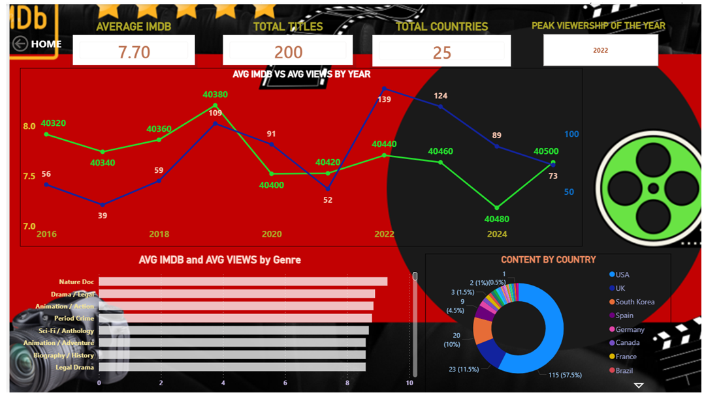
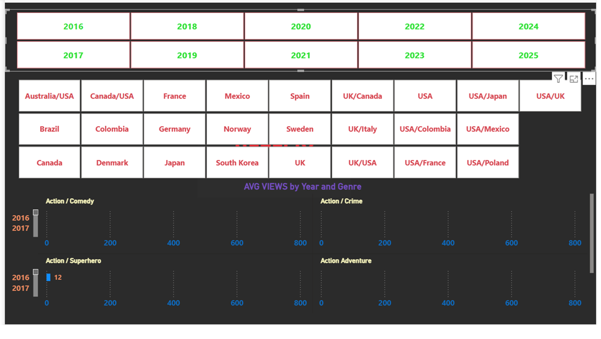

# Netflix-Data-Analysis
Data Analytics project showcasing data cleaning, EDA, KPI reporting, and interactive dashboard development using Power BI.
# 🎬 Netflix Content Analysis Dashboard | Power BI Portfolio Project


> An end-to-end Data Analytics project analyzing Netflix content trends, genre distribution, country-wise production, ratings, and release patterns — visualized through an interactive Power BI dashboard.

---

## 📸 Dashboard Preview

### Page 1 — Dashboard page 1 


### Page 2 — Dashboard page 2


> 💡 *To add your screenshots: create an `images/` folder in your repo and upload your `.png` files with the same names above.*

---

## 📌 Project Overview

The goal of this project is to transform raw Netflix content data into meaningful business insights through data analysis and visualization.

### Key Objectives

✅ Clean and prepare raw Netflix data  
✅ Perform data transformation and validation  
✅ Analyze content trends across genres, countries, ratings, and release years  
✅ Build an interactive Power BI dashboard  
✅ Generate business insights for data-driven decision making  

---

## 🛠️ Tools & Technologies Used

| Tool        | Purpose                               |
| ----------- | ------------------------------------- |
| Power BI    | Dashboard Development & Visualization |
| Excel       | Data Cleaning & Validation            |
| SQL         | Data Querying & Analysis              |
| Python      | Exploratory Data Analysis (EDA)       |
| Pandas      | Data Manipulation                     |
| NumPy       | Data Processing                       |
| Matplotlib  | Data Visualization                    |

---

## 📂 Dataset Information

**Source:** [Kaggle — Netflix Movies and TV Shows](https://www.kaggle.com/datasets/shivamb/netflix-shows)

The dataset contains Netflix Movies and TV Shows with the following attributes:

| Column         | Description                        |
| -------------- | ---------------------------------- |
| Title          | Name of the content                |
| Type           | Movie or TV Show                   |
| Genre          | Content genre/category             |
| Country        | Country of production              |
| Rating         | Audience rating (e.g., PG, TV-MA)  |
| Release Year   | Year the content was released      |
| Date Added     | Date added to Netflix              |
| Duration       | Runtime (minutes) or seasons       |
| Director       | Director name                      |
| Cast           | Main cast members                  |

---

## 🚀 How to Use

1. **Clone the repository**
   ```bash
   git clone https://github.com/joshna545/Netflix-Data-Analysis.git
   ```

2. **Download Power BI Desktop** (free) from [Microsoft](https://powerbi.microsoft.com/desktop/)

3. **Open the dashboard file**
   ```
   Netflix_Analysis.pbix
   ```

4. Explore the interactive dashboard — use filters and slicers to drill down into insights.

---

## 🔄 Project Workflow

### 1️⃣ Data Collection
- Imported Netflix content dataset from Kaggle
- Validated data quality and completeness

### 2️⃣ Data Cleaning
- Removed duplicate records
- Handled missing values
- Standardized categorical fields
- Corrected inconsistent formatting

### 3️⃣ Data Transformation
- Created calculated columns
- Prepared dimensions for analysis
- Structured data for dashboard reporting

### 4️⃣ Exploratory Data Analysis (EDA)
Analyzed:
- Content growth over time
- Genre popularity
- Country-wise content production
- Rating distribution
- Movies vs TV Shows comparison

### 5️⃣ Dashboard Development
Built interactive Power BI dashboards featuring:
- KPI Cards
- Bar Charts & Column Charts
- Pie Charts
- Trend Analysis
- Filters & Slicers
- Drill-down Visualizations

---

## 📈 Dashboard Highlights

| Section              | What It Shows                                           |
| -------------------- | ------------------------------------------------------- |
| Content Overview     | Total Movies & TV Shows, Growth Trends, Year-wise Releases |
| Genre Analysis       | Most Popular Genres, Distribution & Trends              |
| Country Analysis     | Top Content Producing Countries, Regional Comparison    |
| Ratings Analysis     | Distribution of Ratings, Audience Classification       |
| Release Trend        | Content Added by Year, Growth Pattern Visualization     |

---

## 🔍 Key Business Insights

### 🎥 Content Type Distribution
- Movies account for the majority of Netflix content.
- TV Shows have shown consistent growth over recent years.

### 🌎 Geographic Insights
- The United States contributes the highest number of titles.
- Content production is concentrated among a few major countries.

### 🎭 Genre Insights
- Drama and Comedy are among the most dominant genres.
- Genre diversity has increased over time.

### ⭐ Ratings Insights
- Most content falls under mature audience ratings (TV-MA, TV-14).
- Family and children's content represent a smaller proportion.

### 📅 Release Trends
- Significant increase in content additions after 2018.
- Netflix has aggressively expanded its content library in recent years.

---

## 📊 Skills Demonstrated

- ✅ Data Cleaning & Validation
- ✅ Data Transformation
- ✅ Exploratory Data Analysis (EDA)
- ✅ Data Visualization
- ✅ Dashboard Development (Power BI)
- ✅ KPI Reporting
- ✅ Business Intelligence
- ✅ Storytelling with Data
- ✅ Analytical Thinking & Problem Solving

---

## 📁 Repository Structure

```
Netflix-Data-Analysis/
│
├── NETFLIX ANALYSIS.pbix     # Power BI Dashboard file
├── Netflix_2016_2025.csv.csv
          # Raw dataset
├── netflix_queries.sql        # SQL Analysis queries
├── images/
│   ├── DASHBOARD_SCREENSHOT_1.png     # Dashboard screenshot - Page 1
│   └── DASHBOARD_SCREENSHOT_2.png     # Dashboard screenshot - Page 2
└── README.md                   # Project documentation
```

---

## 👨‍💻 Author

**Prajoshna Aare**  
*Data Analyst | SQL Developer | Power BI Enthusiast*

[](https://www.linkedin.com/in/prajoshna-aare-a87554216)
[](https://github.com/joshna545)

---

## ⭐ If you found this project helpful, please star the repository — it helps others discover it!

